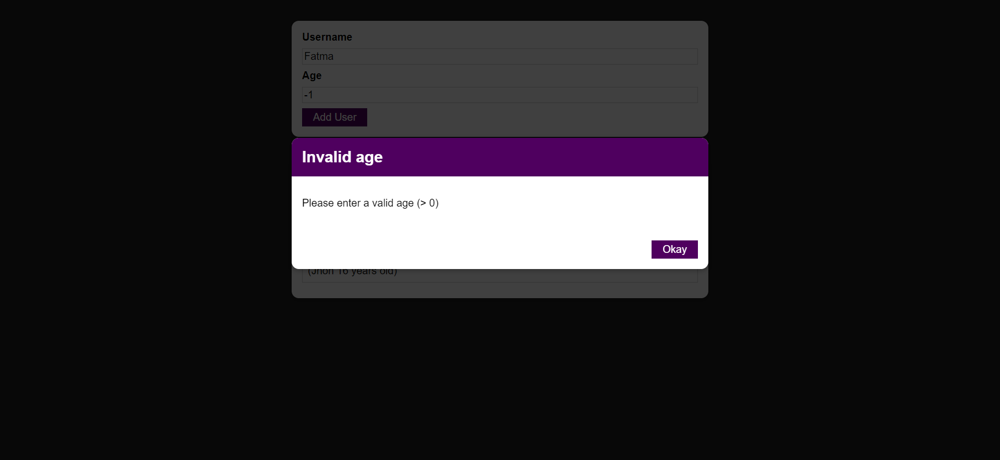

# Add User App

## Description

This is a simple "Add User" app that allows you to input a user's name and age and add them to a list of users. It includes validation to ensure that the age is greater than or equal to 1 and that both the name and age inputs are valid.

## Features

- Input fields for user's name and age.
- Validation for age input to ensure it's greater than or equal to 1.
- Error messages for invalid inputs.
- Adding users to a list when inputs are valid.

## Usage

1. Open the app.
2. Enter the user's name in the "Name" field.
3. Enter the user's age in the "Age" field.
4. Click the "Add User" button.

If the age input is less than 1 or any of the inputs are invalid (e.g., empty name), you will see an error message. Otherwise, the user will be added to the list of users.

## Screenshots

Adding users 

If one of the input fields is empty

If the age is less than 1

