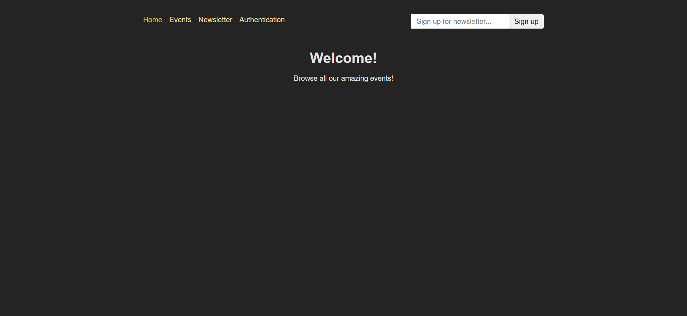
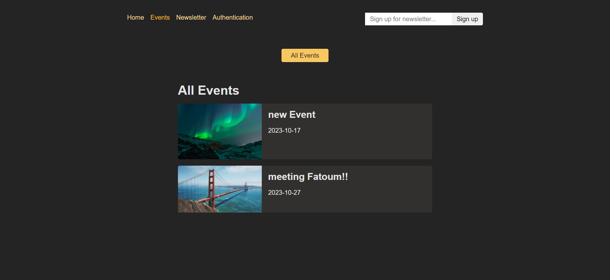
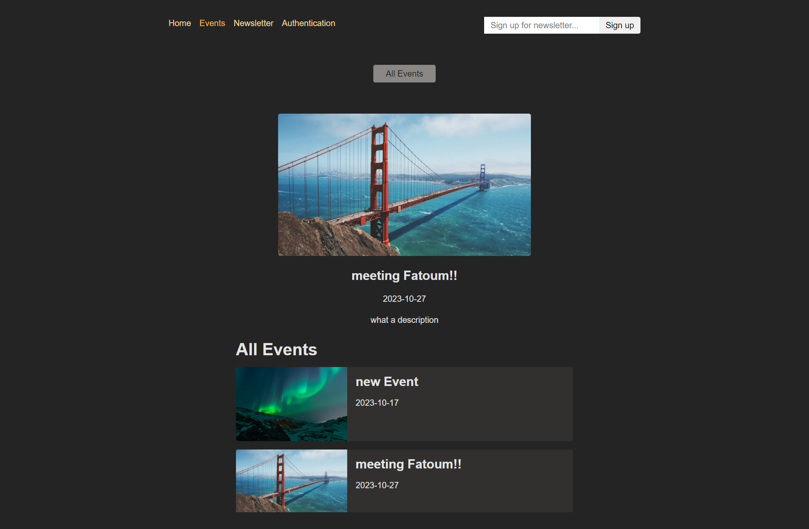
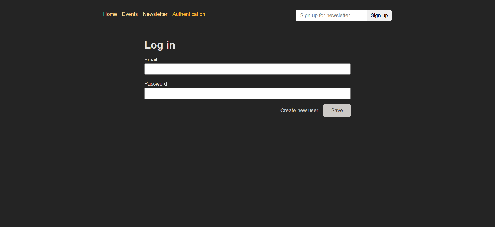
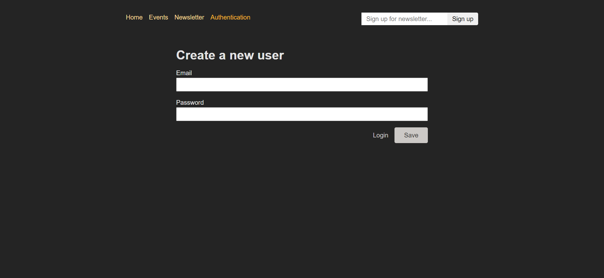
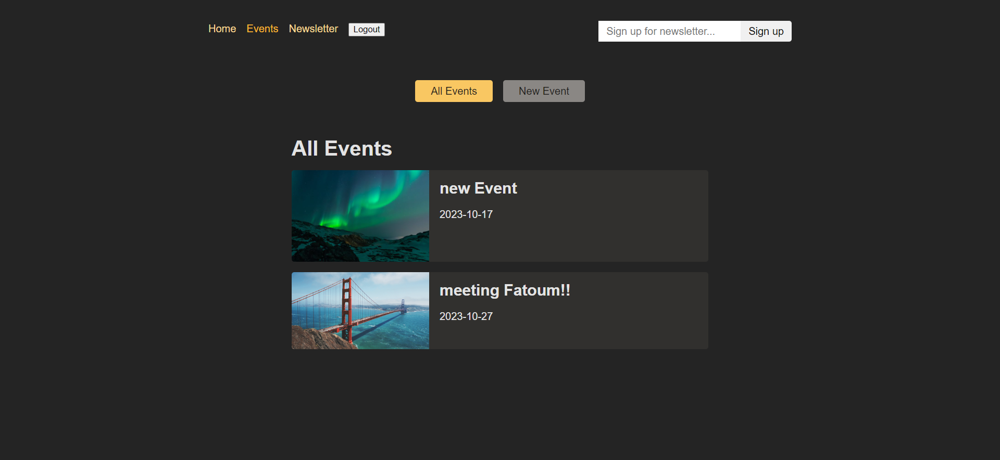
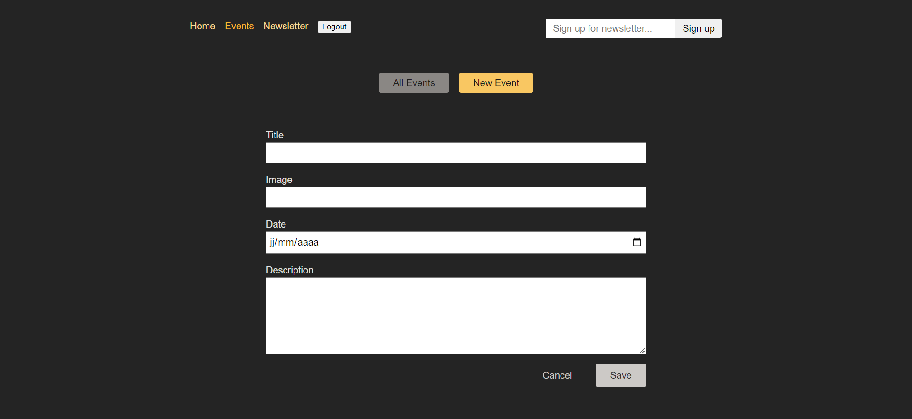

# Authentication Practice

## Overview

This project is focused on implementing user authentication using tokens and dynamically managing the user interface based on the user's authentication status.

## Authentication using Tokens

- We have implemented a robust authentication system that utilizes tokens to secure user access to our application.
- User authentication helps protect user data and ensures secure interactions with the application.

## Managing the User Interface

- The user interface of this project is intelligently managed based on the user's authentication status.
- When a user is authenticated, they have access to specific featuresor functionality tailored to their role.
- Unauthenticated users are presented with a different UI, guiding them through the authentication process.

## Screenshots

no add new event button is shown

no edit or delete buttons are shown

after logging in
the authentification is mutated by the logout button

we can add a new event

we can delete and edit

## Technologies Used

- React js
- React router
- HTML/CSS

## Getting Started

- clone the repo
- cd Authentication-Practice
- npm install
- npm start

