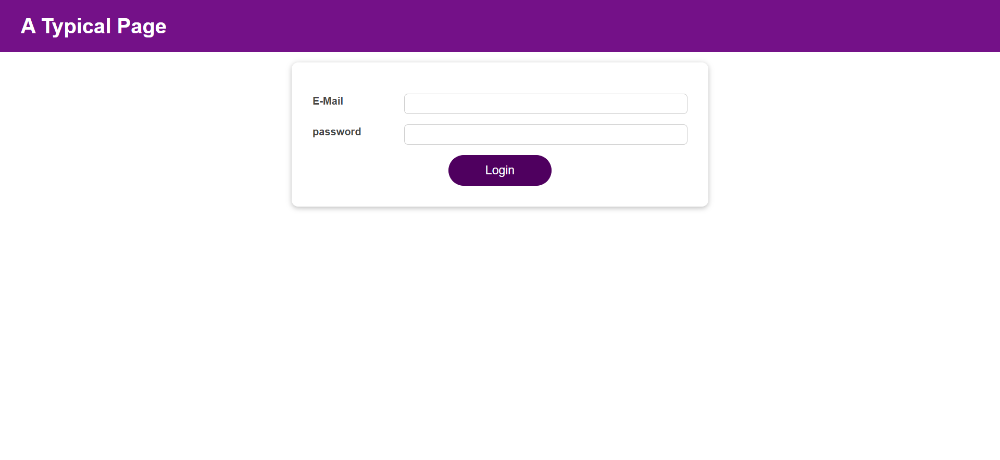

# Authentication App

Welcome to the Authentication App! This app provides a simple login interface with email and password input fields.

## Features

- User authentication with email and password.
- A user-friendly login interface.
- A logoaut button on the home page.

## Technologies Used

- React for building the user interface.
- CSS modules for styling the components.

## Learning Goals

During the development of this authentication app, I gained a deep understanding of the following React hooks and concepts:

- **useState**
- **useEffect**
- **useReducer**
- **useContext**
- **useRef**

These skills have not only enhanced my understanding of React but also equipped me with valuable tools for building more robust and dynamic web applications.

## Demo

You can see a live demo of this app [here](#link-to-live-demo).

## Getting Started

Follow these steps to set up and run the Authentication App locally:

git clone 
cd Authentication-App 
npm install && \  # or "yarn install" if you prefer yarn
npm start          # or "yarn start" if you prefer yarn

## Screenshots

Here are some screenshots of the Authentication App:

