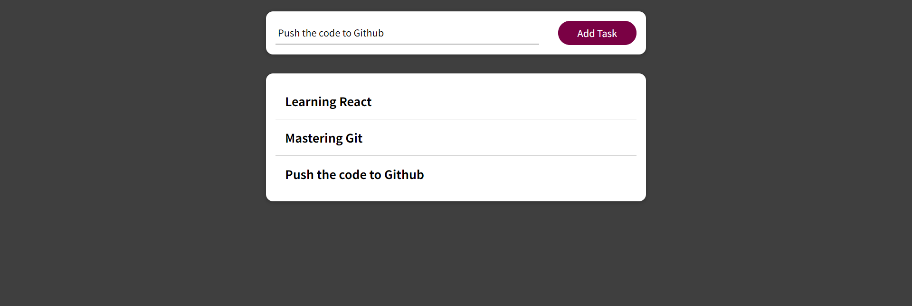

# Custom Hooks Demos

Welcome to the Custom Hooks Demos repository! This repository contains two simple React applications, "Counter-App" and "Add-Task-App," for building custom React hooks.

## Counter-App

**Counter-App** is a basic React application that demonstrates the use of a custom React hook to manage and display a counter.

## Custom HTTP Request Hook

In the **Add-Task-App**, we have created a custom React hook, `useHttp`, to simplify HTTP requests. This hook abstracts away the complexity of making API calls and handling loading and error states.

## Screenshots

### Counter App

### Add Task App

## Getting Started

To run these demos on your local machine, follow these steps:

- `git clone https://github.com/FatmaSliti/React-Course-Demos.git`
- `cd Custom-Hooks-Demos`
- `cd Counter-App` or `cd Add-Task-App`
- `npm install`
- `npm start`
