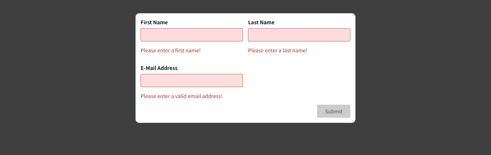
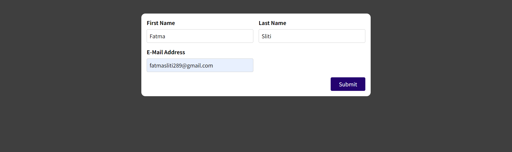

# Form Input Validation App

This is a simple demo project that showcases form input validation in a React application, including examples of custom hooks and the useReducer hook for managing form state and validation.

## Screenshots

Here are some screenshots from the app to give you a visual overview:

## Getting Started
1. Clone the repository
2. cd Form-Input-Validation-App
3. npm install
4. npm start
