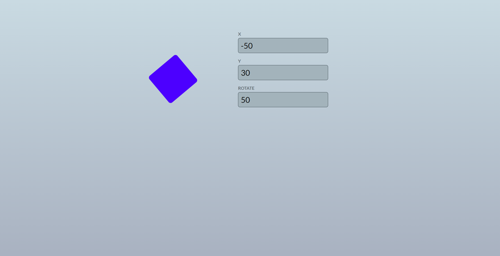
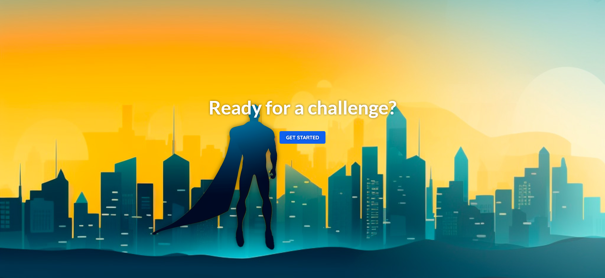
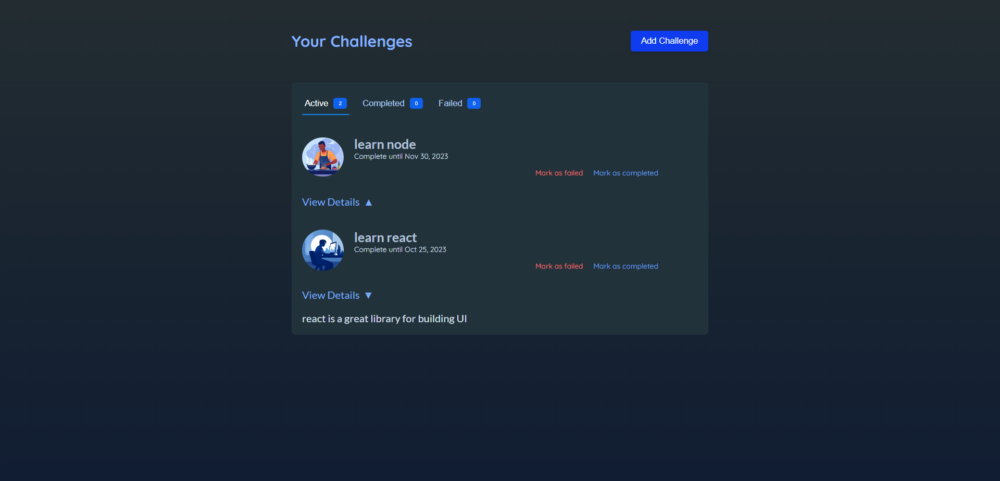

# Learning Animation (with Framer Motion)

These demos are used for learning animation with Framer Motion! This repository serves as my sandbox for experimenting and honing my animation 
skills using Framer Motion, a powerful animation library for React.

## Preview 

This is a preview for the first demo

This is a preview of the second demo, from which I gained valuable insights during this practice

