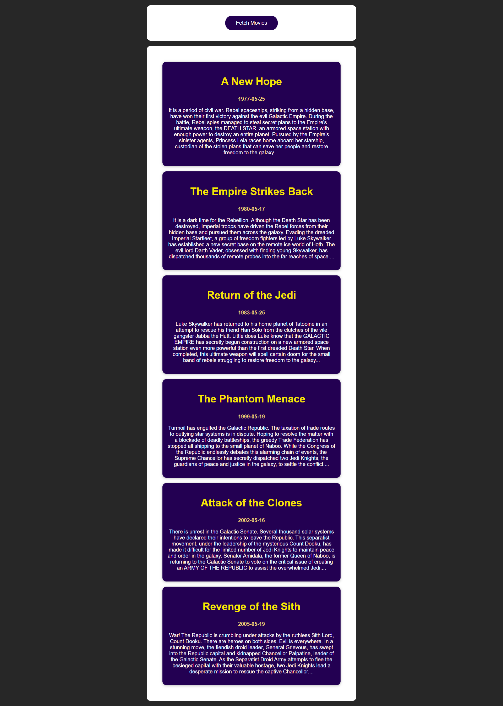
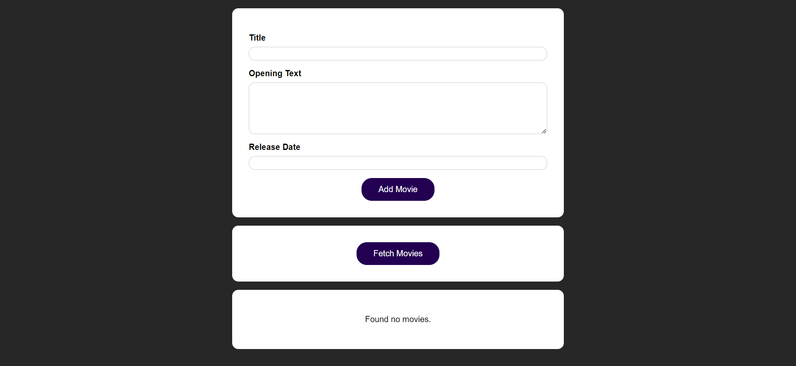
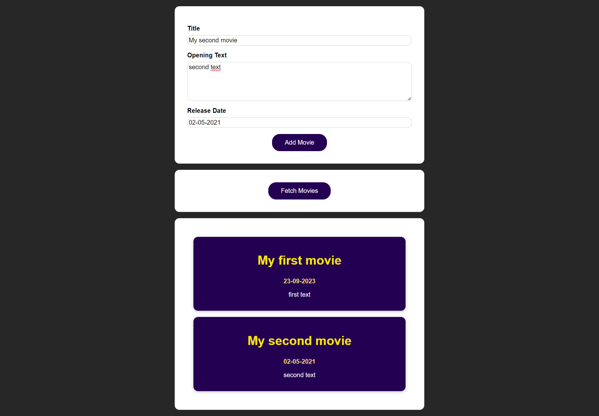

# Movie App

Welcome to the Movie App repository! This app showcases two demos: one for fetching movies from the Star Wars API and the other for fetching and sending data to a Firebase backend.

## Demo 1: Fetching Movies from Star Wars API

In this demo, we'll demonstrate how to fetch movie data from the Star Wars API and display it in our application.

## Demo 2: Fetching and Sending Data to Firebase Backend

In this demo, we'll demonstrate how to fetch data from a Firebase backend and send data to it.

## Learning Goals

- Learn how to send HTTP requests to external APIs (Star Wars API).
- Understand how to interact with Firebase for data storage and retrieval.

## Screenshots

### Demo 1: Fetching Movies from Star Wars API
  

### Demo 2: Fetching and Sending Data to Firebase Backend

## Usage
git clone 'repo path'
- `cd Movie-App`
- `cd Movie-Finder-app` or `cd movie-manager-app`
- `npm install`
- `npm start`
