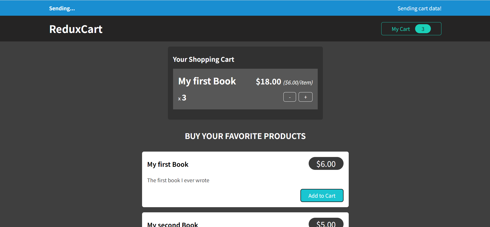

# Redux Cart Demo

This project is a demonstration of a simple shopping cart application implemented using Redux. It showcases advanced Redux concepts including action creators, asynchronous operations with `useEffect` and Redux Thunk, and integration with Redux DevTools.

## Features

- Add products to the shopping cart.
- Remove products from the shopping cart.
- View the total quantity and price of items in the cart.
- Integration with Redux DevTools for debugging and inspecting the Redux store.

## Technologies Used

- React.js
- Redux
- Redux Thunk (for asynchronous actions)
- Redux DevTools Extension
- JavaScript (ES6+)
- CSS (for styling)

## Screenshots

## Installation

To run this project locally, follow these steps:

1. Clone the repository to your local machine
2. cd Redux-Cart
3. npm install
4. npm start

