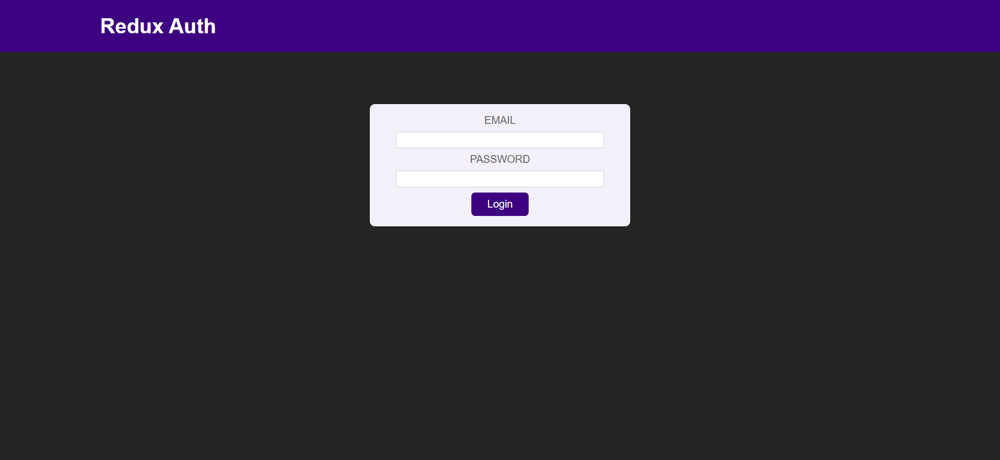
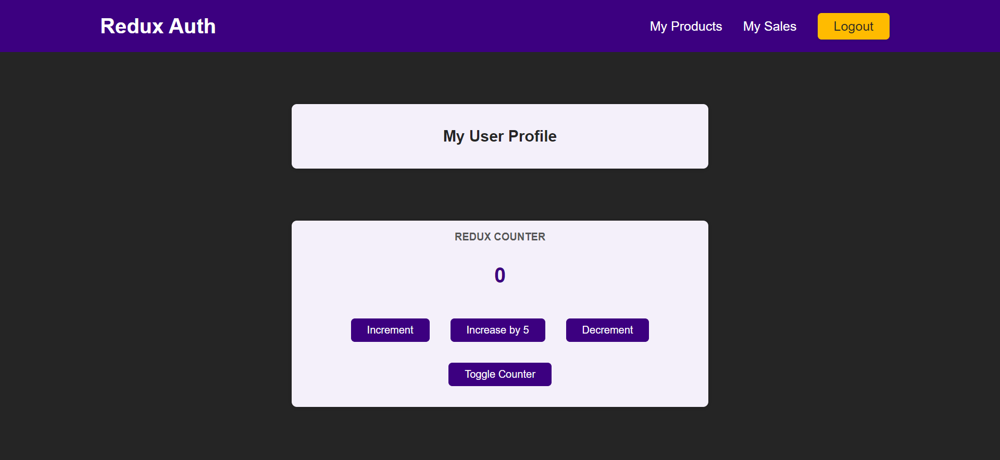

Redux training App

This is a demonstration application developed to establish a strong grasp of Redux and Redux Toolkit.

## Features

- [x] Implemented Redux Toolkit, simplifying state management.
- [x] Utilized Redux Toolkit's `createSlice` for reducers.
- [x] Connected components to the Redux store powered by Redux Toolkit.

## Description

This project served as a hands-on learning experience for mastering Redux with the help of Redux Toolkit. Redux Toolkit greatly simplified the setup of Redux, enabling efficient state management. I utilized `createSlice` to define reducers effortlessly, which improved code organization and maintainability.

Connecting components to the Redux store was a breeze with Redux Toolkit, thanks to its intuitive API. Redux DevTools, integrated seamlessly with Redux Toolkit, allowed for real-time state inspection and debugging, streamlining the development process.

## Screenshots

