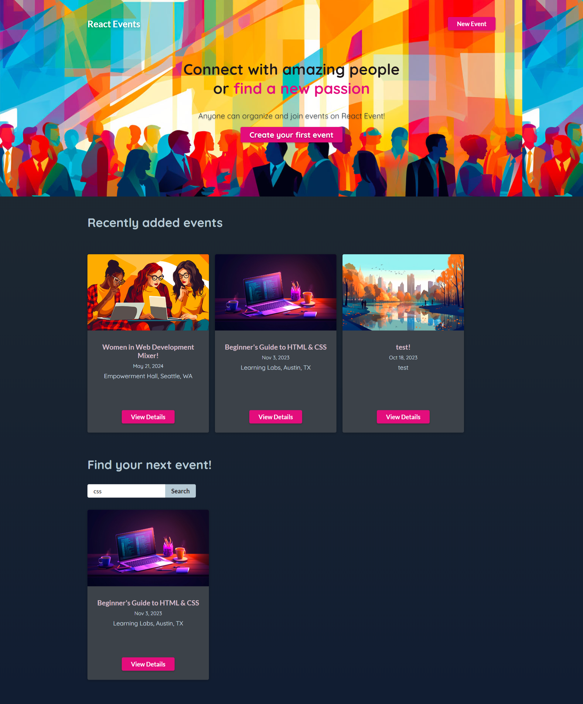
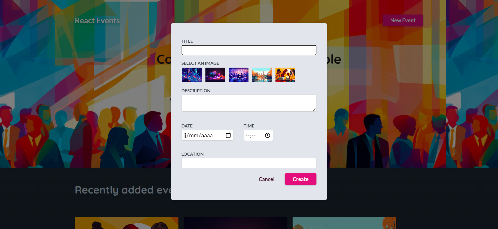
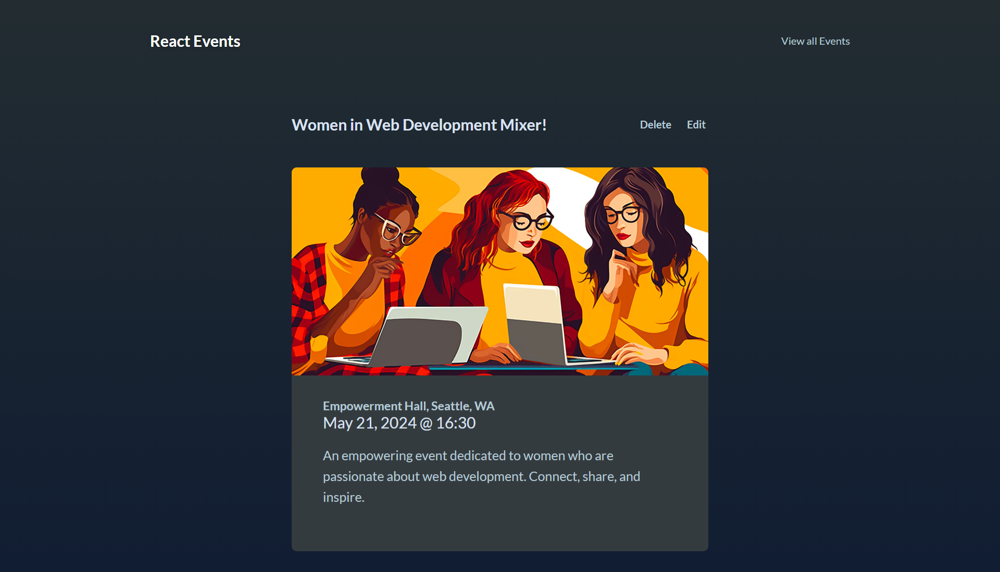
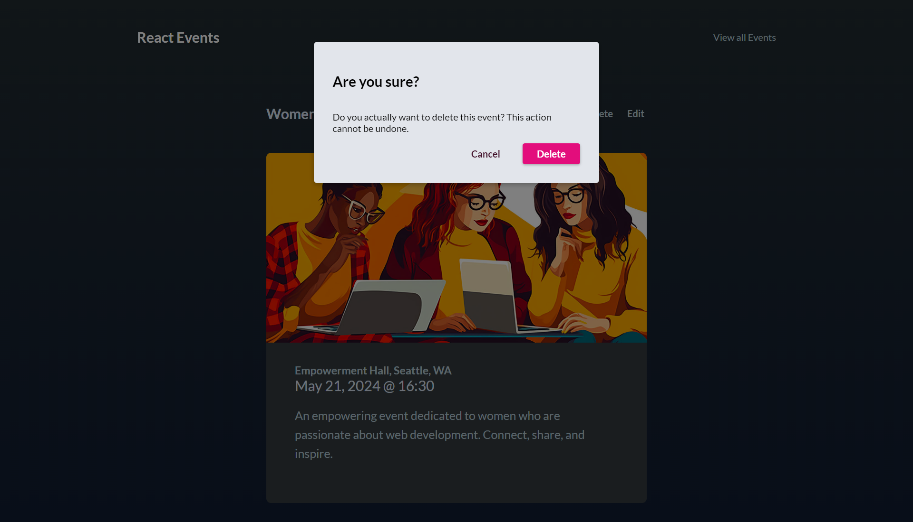
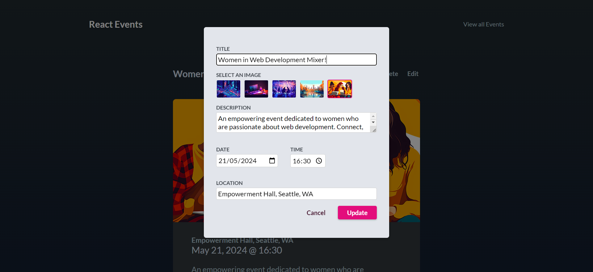

# React Events
This project was created with the primary goal of gaining in-depth knowledge and expertise in using Tanstack Query (React Query). Through this project, I explored the features and best practices of Tanstack Query to build efficient and performant web applications.

## Features

- **Data Fetching**: Explore how to fetch data from various sources, including APIs, databases, and more, using Tanstack Query.

- **Caching**: Learn the art of caching data for improved performance and reducing unnecessary network requests.

- **Mutations**: Understand how to perform data mutations and updates with Tanstack Query.

- **Optimistic Updates**: Implement optimistic updates to provide a smoother user experience.

- **Error Handling**: Learn how to handle errors and provide meaningful feedback to users.

- **Background Data Sync**: Explore background data synchronization and refreshing strategies.

- **Devtools**: Make the most of the built-in developer tools for debugging and analyzing queries.

- ...

## Screenshots

# React + Vite

This template provides a minimal setup to get React working in Vite with HMR and some ESLint rules.

Currently, two official plugins are available:

- [@vitejs/plugin-react](https://github.com/vitejs/vite-plugin-react/blob/main/packages/plugin-react/README.md) uses [Babel](https://babeljs.io/) for Fast Refresh
- [@vitejs/plugin-react-swc](https://github.com/vitejs/vite-plugin-react-swc) uses [SWC](https://swc.rs/) for Fast Refresh
