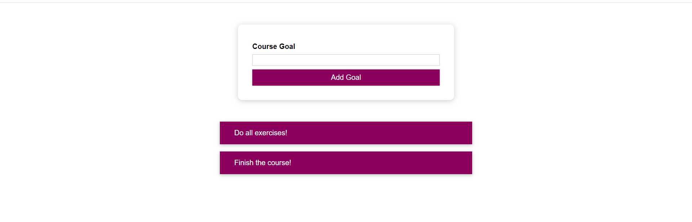
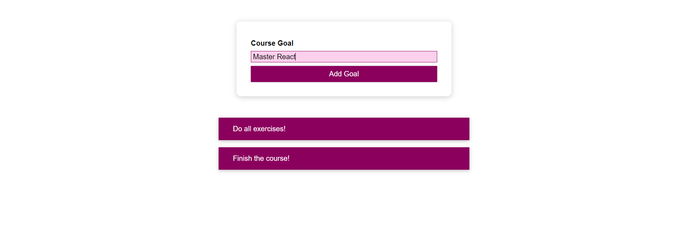
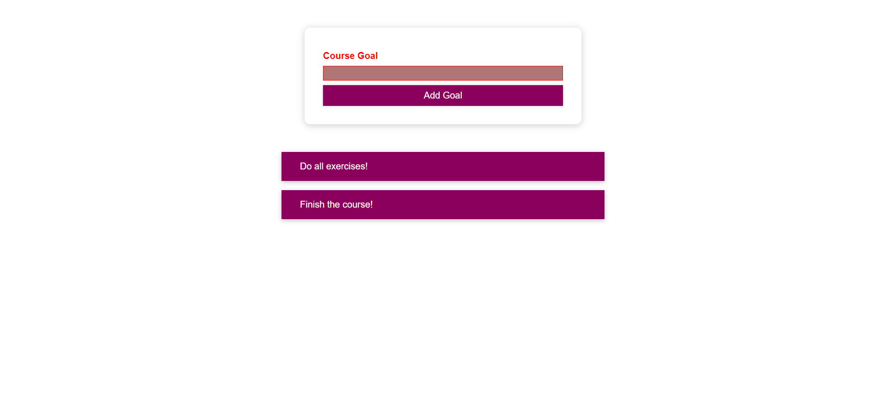

# Course Goal Demo App

Welcome to the Course Goal Demo App! This simple web application is designed to help you manage and track your personal learning goals for different courses or subjects.

## My Learning Goals

Through my usage of the Course Goal Demo App, I have achieved the following personal learning goals related to CSS:

1. **Conditional and Dynamic Styles:** I've practiced applying conditional styles to components, making them responsive to different states and user interactions.

2. **Styled Components Mastery:** I've honed my skills in creating and using styled components to encapsulate CSS styles within React components effectively.

3. **CSS Modules Proficiency:** I now have a solid understanding of CSS Modules and how to use them for scoped and modular CSS styles in my projects.

## Screenshots

Here are some screenshots of the Course Goal Demo App :

This screenshot shows the Course Goal Demo App's main interface

while entering a valid input (not empty)

if the user enter an empty input

