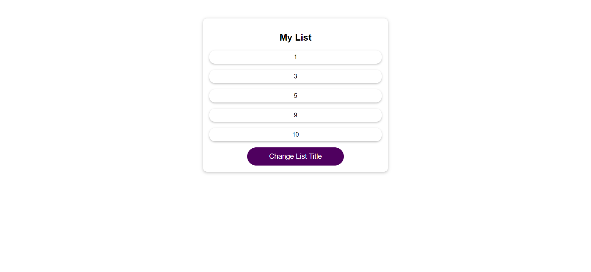

# React Optimization Techniques Demo

Two React demos showcasing various optimization techniques.

## Technologies Used

- React.js

- ## Learning Goals

A look behind the scenes of React (component re-renders / state ...)

These demos demonstrates three important optimization techniques in React:

1. **`useCallback`**: Learn how to optimize function references to prevent unnecessary re-renders and improve performance.

2. **`useMemo`**: Discover how to memoize computed values, reducing redundant calculations and rendering.

3. **`React.memo`**: Explore how to optimize functional components with memoization to prevent unnecessary renders.

## Screenshots

This is the so-called toggle text app

And this is the optimizing with usememo app

## Installation

To run this project locally, follow these steps:

1. Clone this repository
2. cd `optimization-techniques`
3. cd `optimizing-with-usemomo or toggle-text-app`
4. `npm install`
5. `npm start`

