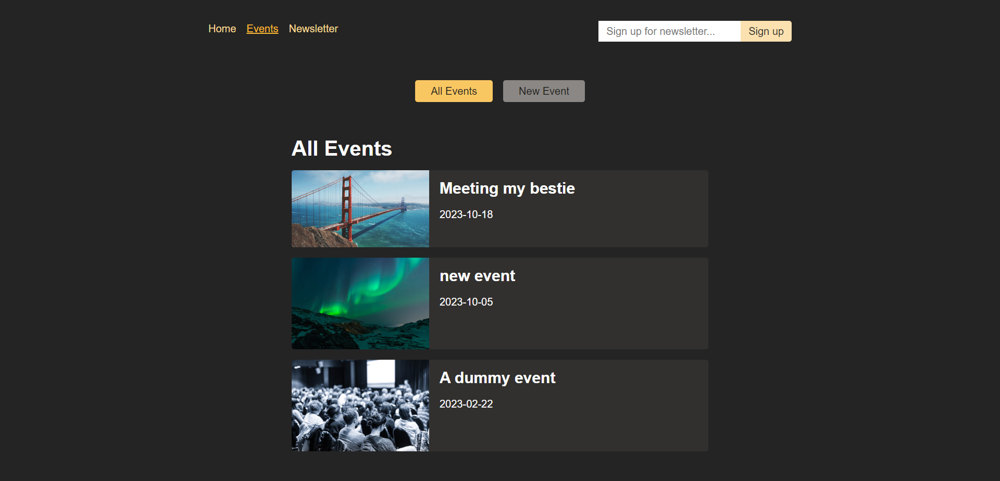
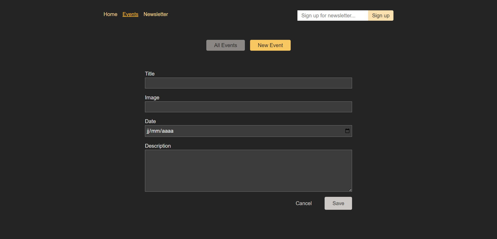
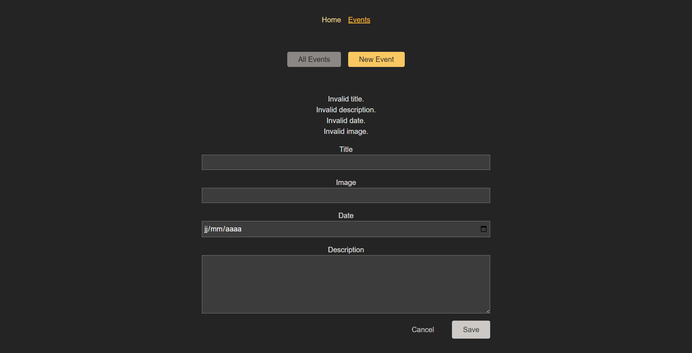
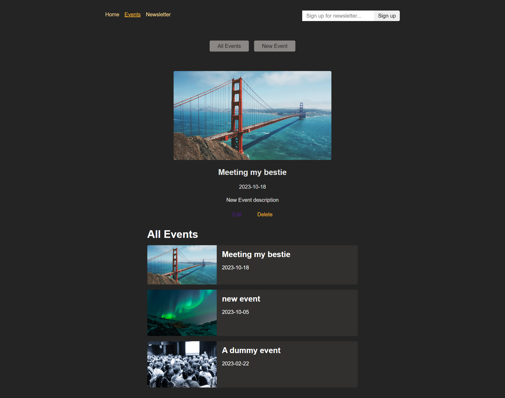
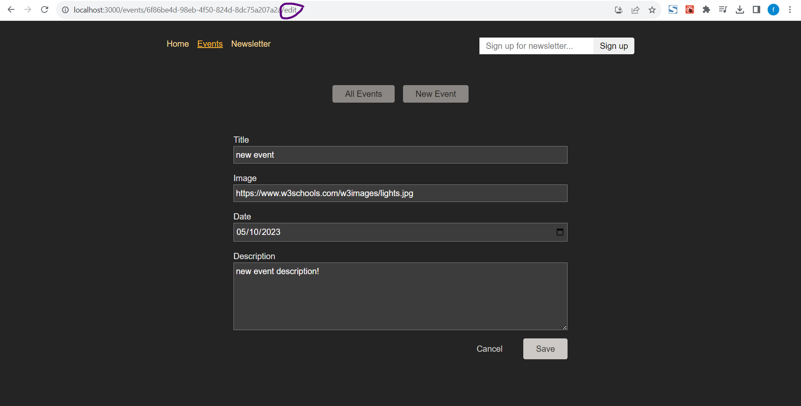
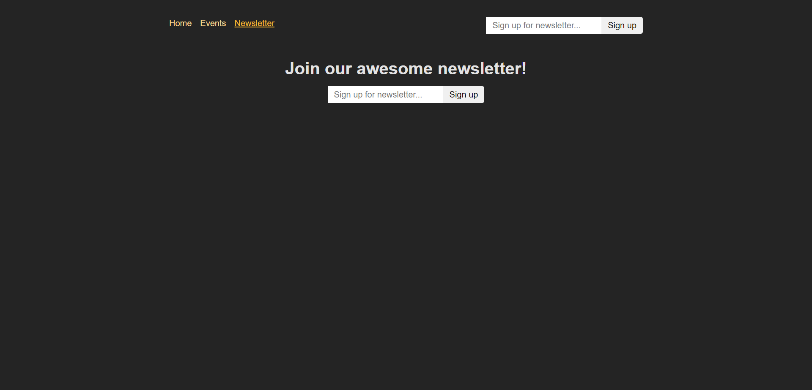

# React Router Practice

This project serves as an illustrative example of the versatile capabilities of React Router in constructing complex single-page applications with multiple routes and seamless
navigation. It offers an extensive exploration of React Router's numerous concepts and functionalities, imparting a comprehensive foundation in route management within a React 
application.

## Features

- **Multi-Page Navigation:** Seamlessly navigate between different sections of the application using React Router's powerful routing capabilities.

- **Dynamic Route Handling:** Dynamically create and manage routes for various components and views within your application.

- **Route Parameters and Nested Routes:** Understand how to pass and extract parameters from routes and implement nested routes for complex page layouts.

- **Navigation Menus:** Create dynamic navigation menus that automatically highlight the active route, enhancing user experience.

- **Error Handling :** Implement error handling and custom 404 pages to provide a more user-friendly experience when something goes wrong.

- **Real-World Use Cases:** Explore real-world application scenarios where React Router is essential for building robust and interactive web applications.

- and much more...

## Technologies Used

- **React:** The project is primarily built using React, a popular JavaScript library for building user interfaces.

- **React Router:** We leverage the React Router library to implement routing and navigation within our React application.

- **HTML and CSS:** The project employs HTML for structuring content and CSS for styling the user interface.

## Screenshots

in case we change the validation from the dev tools the validation from the backend appears

## Getting Started

To run the project on your local machine, follow these straightforward steps:

1. **Clone the Repository**
1. **cd react-router-paractice**
1. **npm install**
1. **npm start**

