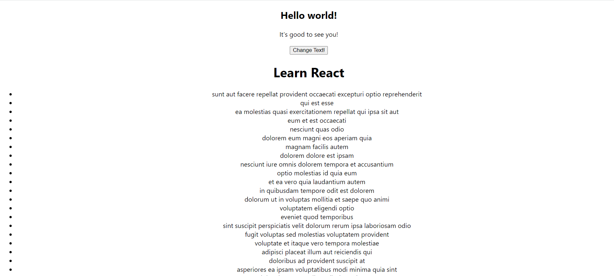

# Unit Testing Demo 

Welcome to the "Unit Testing Demo" repository! In this project, I've had the opportunity to practice unit testing. The project demonstrates the importance of unit testing and how it provides valuable insights into code reliability and functionality.

## My Learning Experience

The goal was to gain a deeper understanding of how unit tests can provide valuable insights into code quality and potential issues. Through this instructor-guided project, I've learned:

- The importance of writing unit tests to verify individual components.
- How to set up a unit testing environment and run tests.
- Strategies for creating effective test cases and assertions.
- The role of mocking and stubbing in unit testing.
- How to interpret test results and identify areas for improvement.

## screenshot

